## MERN STACK IMPLEMENTATION ON AWS
We are going to create a To-Do application that creates a to-do list

### STEP 1 – BACKEND CONFIGURATION (Installing Node.Js, Express.Js, and Mongodb)
The first thing to do is to update and upgrade the linux package repository with the following commands below:

`sudo apt update`

`sudo apt upgrade`

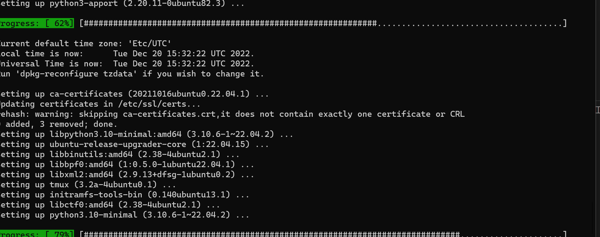

### Next is to get the location of Node.js software from

`curl -fsSL https://deb.nodesource.com/setup_18.x | sudo -E bash -`

Install Node.js on the server with the command below

`sudo apt-get install -y nodejs`

Note: The command above installs both nodejs and npm. NPM is a package manager for Node like apt for Ubuntu, it is used to install Node modules & packages and to manage dependency conflicts.

Verify the node installation with the command below:

`node -v` 

Verify the package manager installation with the command below:

`npm -v`

Application Code Setup
Create a new directory for your Todo project:

`mkdir Todo`

Run the ls command to verify that the Todo directory is created or you can use a -v (verbose) alongside the mkdir command. It returns an output that the directory has been created.

Now change your current directory to the newly created one:

`cd Todo`

### Next, you will use the command

`npm init`

This command is to initialise your project, so that a new file named package.json will be created. This file will contain information about your application and the dependencies that it needs to run. Follow the prompts after running the command. You can press Enter several times to accept default values, then accept to write out the package.json file by typing yes.

Then you run the command ls to be sure that you have package.json file created.

Image

## Installing ExpressJs
Before we proceed to installing Express.Js, have it at the back of your mind that Express is a framework for Node.js, therefore a lot of things developers would have programmed is already taken care of out of the box. Therefore, it simplifies development, and abstracts a lot of low-level details. For example, Express helps to define routes of your application based on HTTP methods and URLs.

To use express, install it using npm:

`npm install express`

Now create a file index.js with the command below:

`touch index.js`

Run ls to confirm that your index.js file is successfully created

Install the dotenv module

`npm install dotenv`

Open the index.js file with the command below:

`nano index.js`

Type the code below into it and save.
```
const express = require('express');
require('dotenv').config();
 
const app = express();
 
const port = process.env.PORT || 5000;
 
app.use((req, res, next) => {
res.header("Access-Control-Allow-Origin", "\*");
res.header("Access-Control-Allow-Headers", "Origin, X-Requested-With, Content-Type, Accept");
next();
});
 
app.use((req, res, next) => {
res.send('Welcome to Express');
});
 
app.listen(port, () => {
console.log(`Server running on port ${port}`)
});
```

Notice that we have specified to use port 5000 in the code. This will be required later when we go on the browser.

Use ctrl x to exit then 'y' to save the file

Now it is time to start our server to see if it works. Open your terminal in the same directory as your index.js file and type:

`node index.js`

If everything goes well, you should see Server running on port 5000 in your terminal.


Now we need to open this port in EC2 Security Groups. You need make sure your security group settings on AWS allows TCP port 5000 traffic.

Open up your browser and try to access your server’s Public IP or Public DNS name followed by port 5000:

http://<PublicIP-or-PublicDNS>:5000

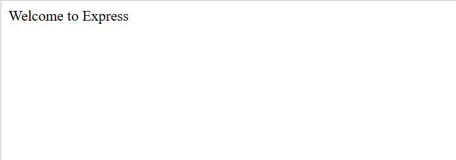

NOTE: To find your public IP address, please check your AWS console.

## Routes
There are three actions that our To-Do application needs to be able to do:

Create a new task
Display list of all tasks
Delete a completed task
Each task will be associated with some particular endpoint and will use different standard HTTP request methods: POST, GET, DELETE.

For each task, we need to create routes that will define various endpoints that the Todo app will depend on. So let us create a folder routes in the Todo folder.

`mkdir routes`

Change directory to routes folder.

`cd routes`

Now, create a file api.js with the command below:

`touch api.js`

Open the file with the command below:

`nano api.js`

Copy the code below to the file and save it
```
const express = require ('express');
const router = express.Router();
 
router.get('/todos', (req, res, next) => {
 
});
 
router.post('/todos', (req, res, next) => {
 
});
 
router.delete('/todos/:id', (req, res, next) => {
 
})
 
module.exports = router;
```
## Models
The interesting thing now is that we need to design a model because the app will use Mongodb, a NoSQL database.

A model is what gives JavaScript-based apps their interactive nature.

We will also use models to define the database schema . This is important so that we will be able to define the fields stored in each Mongodb document.

In essence, the Schema is a blueprint of how the database will be constructed, including other data fields that may not be required to be stored in the database. These are known as virtual properties

To create a Schema and a model, install mongoose which is a Node.js package that makes working with mongodb easier.

Change directory back Todo folder with cd .. and install Mongoose

`npm install mongoose`

Create a new folder models:

`mkdir models`

Change the directory into the newly created ‘models’ folder with

`cd models`

Inside the models folder, create a file and name it todo.js

`touch todo.js`

All three commands above can be defined in one line to be executed consequently with help of && operator, like this:

`mkdir models && cd models && touch todo.js`

Open the file created with `nano todo.js` then paste the code below in the file:
```
const mongoose = require('mongoose');
const Schema = mongoose.Schema;
 
//create schema for todo
const TodoSchema = new Schema({
action: {
type: String,
required: [true, 'The todo text field is required']
}
})
 
//create model for todo
const Todo = mongoose.model('todo', TodoSchema);
 
module.exports = Todo;
```
Now we need to update our routes from the file api.js in ‘routes’ directory to make use of the new model.

In Routes directory, open api.js with `nano api.js`, delete the code inside and paste the new code below into it then save and exit
```
const express = require ('express');
const router = express.Router();
const Todo = require('../models/todo');

router.get('/todos', (req, res, next) => {

//this will return all the data, exposing only the id and action field to the client
Todo.find({}, 'action')
.then(data => res.json(data))
.catch(next)
});

router.post('/todos', (req, res, next) => {
if(req.body.action){
Todo.create(req.body)
.then(data => res.json(data))
.catch(next)
}else {
res.json({
error: "The input field is empty"
})
}
});

router.delete('/todos/:id', (req, res, next) => {
Todo.findOneAndDelete({"_id": req.params.id})
.then(data => res.json(data))
.catch(next)
})

module.exports = router;

```
MongoDB Database
We need a database where we will store our data. For this, we will make use of mLab. MLab provides MongoDB database as a service solution (DBaaS), so to make life easy, you will need to sign up for shared clusters free account, which is ideal for our use case.

[Sign up here](https://www.mongodb.com/atlas-signup-from-mlab)

Follow the signup process, select AWS as the cloud provider, and choose your preferred region.


Proceed to creating your first cluster

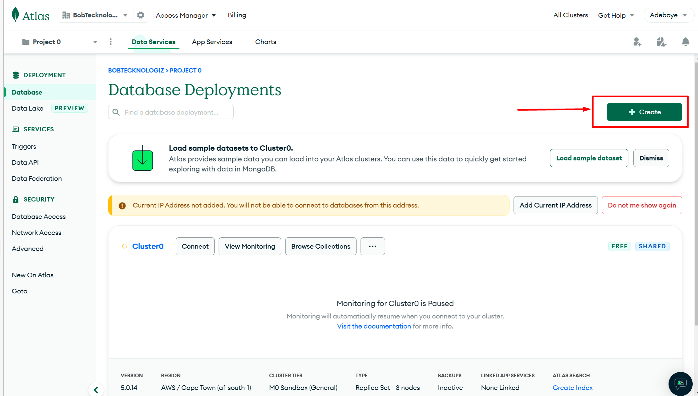

Next step is to allow access to the MongoDB database from anywhere (This option is not secure, but it is ideal for testing)

IMPORTANT NOTE: In the image below, make sure you change the time of deleting the entry from 6 Hours to 1 Week

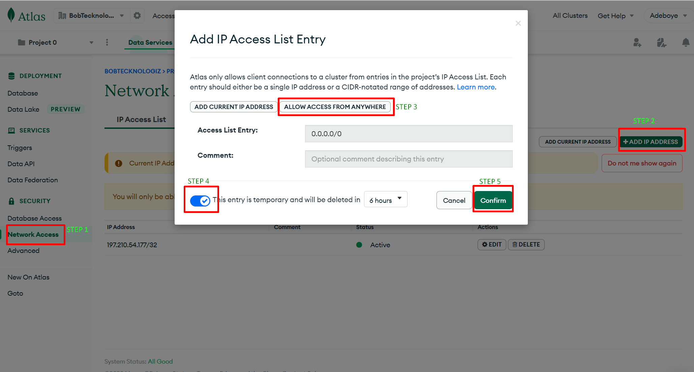

In the index.js file, we specified process.env to access environment variables, but we have not yet created this file. So we need to do that now.

Create a file in your Todo directory and name it .env.

`touch .env`

`nano .env`

Add the connection string to access the database in it, just as below:

DB = 'mongodb+srv://<username>:<password>@<network-address>/<dbname>?retryWrites=true&w=majority'

Ensure to update username, password, network-address and database according to your setup

Here is how to get your connection string
### Step 1
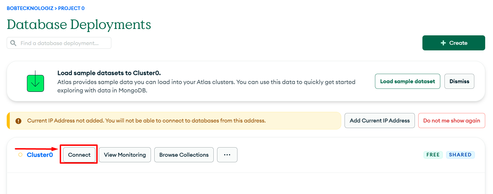

### Step 2
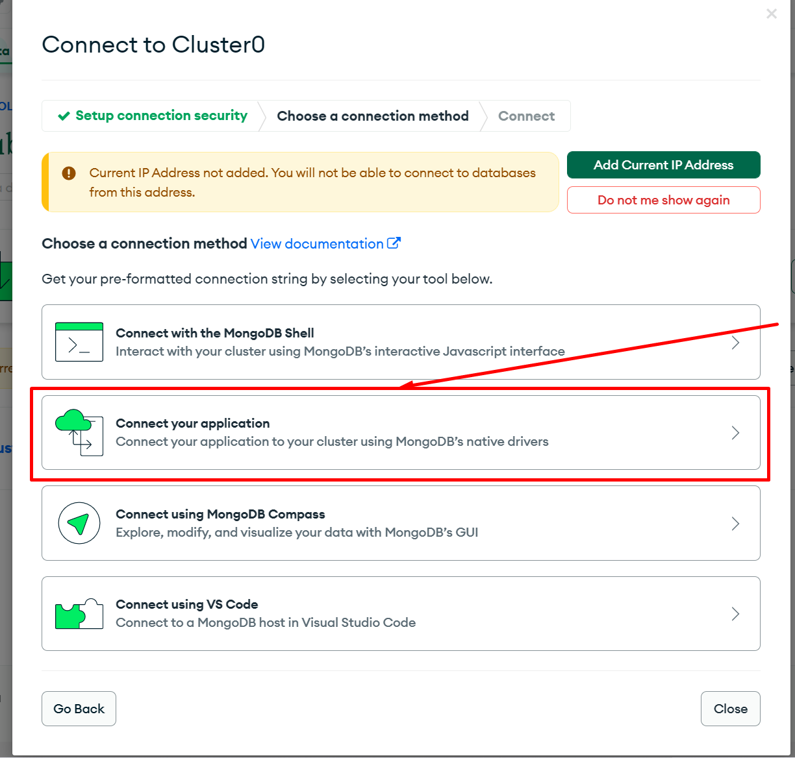

### Step 3
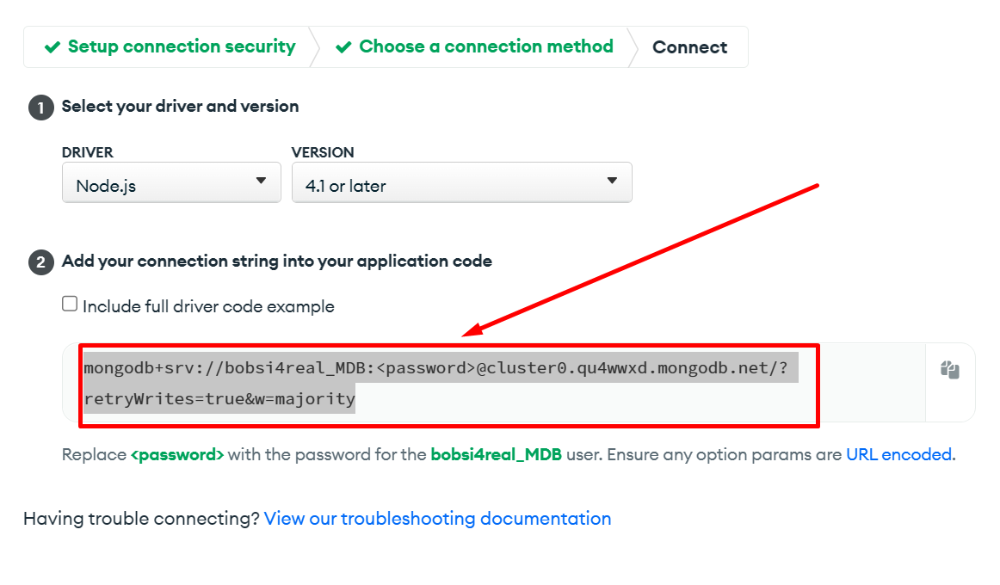

Now we need to update the index.js to reflect the use of .env so that Node.js can connect to the database.

Simply delete existing content in the file, and update it with the entire code below.
```
const express = require('express');
const bodyParser = require('body-parser');
const mongoose = require('mongoose');
const routes = require('./routes/api');
const path = require('path');
require('dotenv').config();
 
const app = express();
 
const port = process.env.PORT || 5000;
 
//connect to the database
mongoose.connect(process.env.DB, { useNewUrlParser: true, useUnifiedTopology: true })
.then(() => console.log(`Database connected successfully`))
.catch(err => console.log(err));
 
//since mongoose promise is depreciated, we overide it with node's promise
mongoose.Promise = global.Promise;
 
app.use((req, res, next) => {
res.header("Access-Control-Allow-Origin", "\*");
res.header("Access-Control-Allow-Headers", "Origin, X-Requested-With, Content-Type, Accept");
next();
});
 
app.use(bodyParser.json());
 
app.use('/api', routes);
 
app.use((err, req, res, next) => {
console.log(err);
next();
});
 
app.listen(port, () => {
console.log(`Server running on port ${port}`)
});
```
Using environment variables to store information is considered more secure and best practice to separate configuration and secret data from the application, instead of writing connection strings directly inside the index.js application file.

Start your server using the command:

node index.js

You shall see a message ‘Database connected successfully’, if so – we have our backend configured. Now we are going to test it.


*Testing Backend Code without Frontend using RESTful API
So far we have written backend part of our To-Do application, and configured a database, but we do not have a frontend UI yet. We need ReactJS code to achieve that. But during development, we will need a way to test our code using RESTfulL API. Therefore, we will need to make use of some API development client to test our code.*

In this project, we will use POSTMAN to test our API.

[Click Install Postman to download and install postman on your machine.](https://www.postman.com/downloads/)

You should test all the API endpoints and make sure they are working. For the endpoints that require body, you should send JSON back with the necessary fields since it’s what we setup in our code.

Now open your Postman, create a POST request to the API http://http://Public_IP_address/:5000/api/todos. This request sends a new task to our Todo list so the application could store it in the database.

Note: Make sure you set header key Content-Type as application/json


Create a POST request


Create a GET request to your API on http://Public_ip_address:5000/api/todos. This request retrieves all existing records from out To-do application (backend requests these records from the database and sends it us back as a response to GET request).

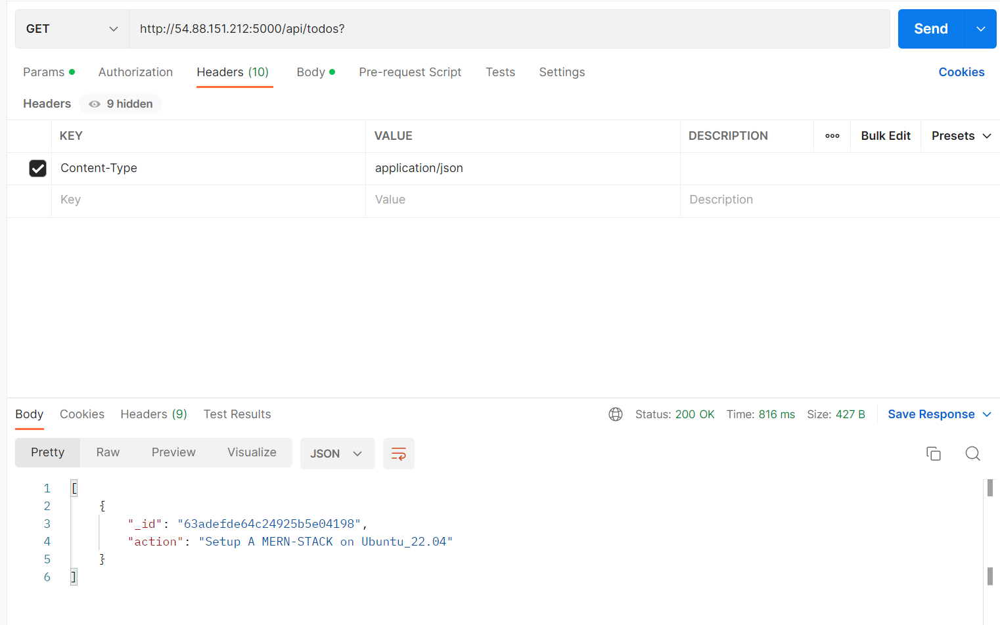

Optional task: Try to figure out how to send a DELETE request to delete a task from out To-Do list.

Hint: To delete a task – you need to send its ID as a part of DELETE request.

By now you have tested backend part of your To-Do application and have made sure that it supports all three operations we wanted:

Add a new task to the list – HTTP POST request
Display a list of tasks – HTTP GET request
Delete an existing task from the list – HTTP DELETE request
You have successfully created your Backend, now let's go create the Frontend.

## STEP 2 – FRONTEND CREATION
Since we are done with the functionality we want from our backend and API, it is time to create a user interface for a Web client (browser) to interact with the application via API. To start out with the frontend of the To-do app, we will use the create-react-app command to scaffold our app.

In the same root directory as your backend code, which is the Todo directory, run:

`npx create-react-app client`

This will create a new folder in your Todo directory called client, where you will add all the react code.

### Running a React App
Before testing the react app, there are some dependencies that need to be installed.

 1. Install concurrently: It is used to run more than one command simultaneously from the same terminal window.

`npm install concurrently --save-dev`

 2. Install nodemon: It is used to run and monitor the server. If there is any change in the server code, nodemon will restart it automatically and load the new changes.

`npm install nodemon --save-dev`

In Todo folder open the package.json file. Change the highlighted part of the below screenshot and replace with the code below.
```
"scripts": {
"start": "node index.js",
"start-watch": "nodemon index.js",
"dev": "concurrently \"npm run start-watch\" \"cd client && npm start\""
},
```
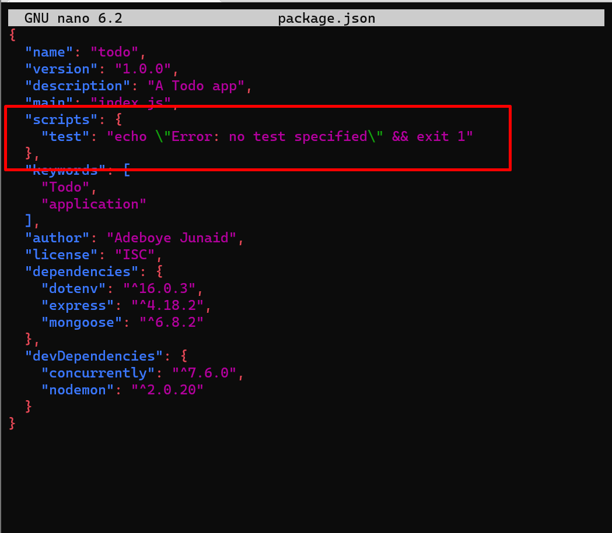

Configure Proxy in package.json
Change directory to ‘client’

cd client

Open the package.json file

nano package.json

Add the key value pair in the package.json file

"proxy": "http://localhost:5000"

The whole purpose of adding the proxy configuration in number 3 above is to make it possible to access the application directly from the browser by simply calling the server url like http://localhost:5000 rather than always including the entire path like http://localhost:5000/api/todos

Now, ensure you are inside the Todo directory, and simply do:

`npm run dev`

Your app should open and start running on localhost:3000

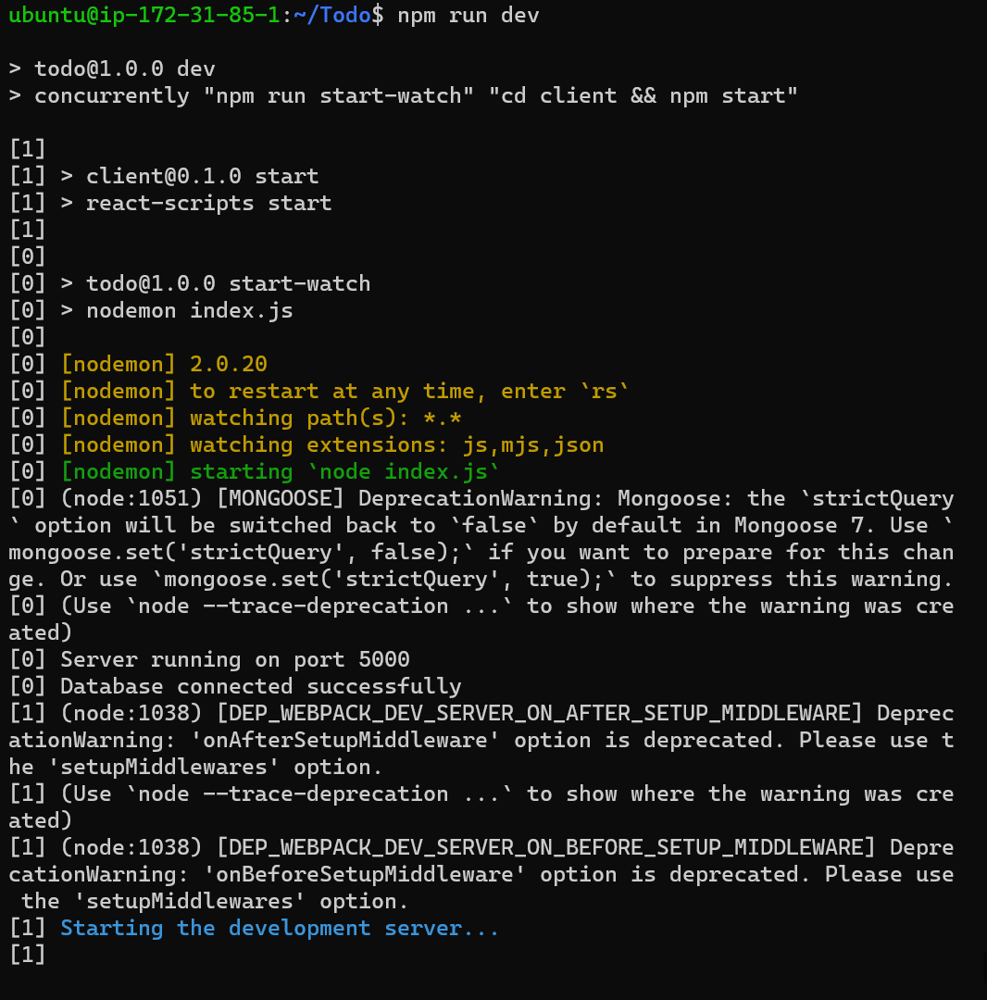

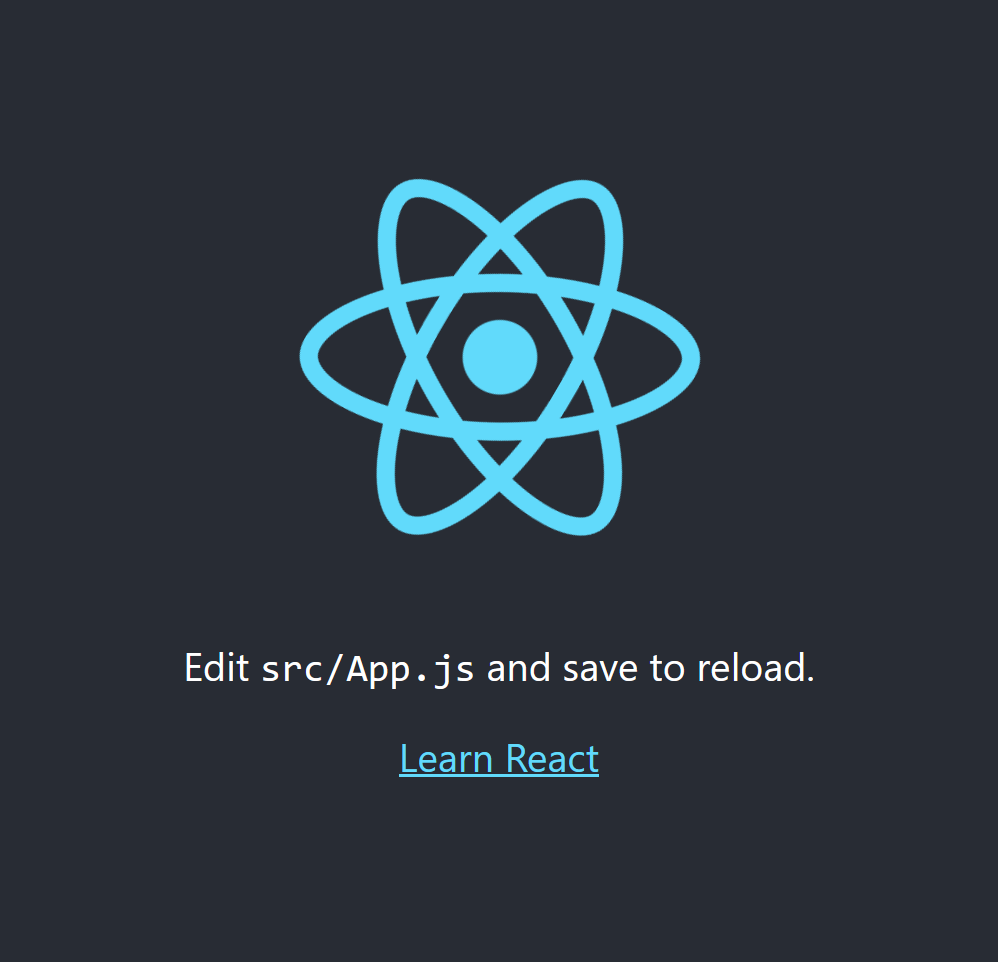

Important note: In order to be able to access the application from the Internet you have to open TCP port 3000 on EC2 by adding a new Security Group rule. You already know how to do it.

Creating your React Components
One of the advantages of react is that it makes use of components, which are reusable and also make code modular. For our Todo app, there will be two stateful components and one stateless component.

From your Todo directory run:

`cd client` 

move to the src directory

`cd src`

Inside your src folder create another folder called components:

`mkdir components`

Move into the components directory with:

`cd components`

Inside ‘components’ directory create three files - Input.js, ListTodo.js and Todo.js.

`touch Input.js ListTodo.js Todo.js`

Open Input.js file:

`nano Input.js`

Copy and paste the following:
```
import React, { Component } from 'react';
import axios from 'axios';
 
class Input extends Component {
 
state = {
action: ""
}
 
addTodo = () => {
const task = {action: this.state.action}
 
    if(task.action && task.action.length > 0){
      axios.post('/api/todos', task)
        .then(res => {
          if(res.data){
            this.props.getTodos();
            this.setState({action: ""})
          }
        })
        .catch(err => console.log(err))
    }else {
      console.log('input field required')
    }
 
}
 
handleChange = (e) => {
this.setState({
action: e.target.value
})
}
 
render() {
let { action } = this.state;
return (
<div>
<input type="text" onChange={this.handleChange} value={action} />
<button onClick={this.addTodo}>add todo</button>
</div>
)
}
}
 
export default Input
```
To make use of Axios, which is a Promise based HTTP client for the browser and node.js, you need to cd into your client from your terminal and run yarn add axios or npm install axios.

Move to the clients folder

`cd ../..` 

and install Axios with the command below:

`npm install axios`

Go to the ‘components’ directory

`cd src/components`

After that open your ListTodo.js

`nano ListTodo.js`

in the ListTodo.js copy and paste the following code:
```
import React from 'react';
 
const ListTodo = ({ todos, deleteTodo }) => {
 
return (
<ul>
{
todos &&
todos.length > 0 ?
(
todos.map(todo => {
return (
<li key={todo._id} onClick={() => deleteTodo(todo._id)}>{todo.action}</li>
)
})
)
:
(
<li>No todo(s) left</li>
)
}
</ul>
)
}
 
export default ListTodo
```
Then in your Todo.js file you paste the following code:
```
import React, {Component} from 'react';
import axios from 'axios';
 
import Input from './Input';
import ListTodo from './ListTodo';
 
class Todo extends Component {
 
state = {
todos: []
}
 
componentDidMount(){
this.getTodos();
}
 
getTodos = () => {
axios.get('/api/todos')
.then(res => {
if(res.data){
this.setState({
todos: res.data
})
}
})
.catch(err => console.log(err))
}
 
deleteTodo = (id) => {
 
    axios.delete(`/api/todos/${id}`)
      .then(res => {
        if(res.data){
          this.getTodos()
        }
      })
      .catch(err => console.log(err))
 
}
 
render() {
let { todos } = this.state;
 
    return(
      <div>
        <h1>My Todo(s)</h1>
        <Input getTodos={this.getTodos}/>
        <ListTodo todos={todos} deleteTodo={this.deleteTodo}/>
      </div>
    )
 
}
}
 
export default Todo;
```
We need to make little adjustment to our react code. Delete the logo and adjust our App.js to look like this.

Move to the src folder:

cd ..

Make sure that you are in the src folder and run:

`nano App.js`

Delete all the content in the App.js
Copy and paste the code below into it

```
import React from 'react';
 
import Todo from './components/Todo';
import './App.css';
 
const App = () => {
return (
<div className="App">
<Todo />
</div>
);
}
 
export default App;
```
After pasting, exit the editor.

In the src directory open the App.css

`nano App.css`

Then paste the following code into App.css:

```
.App {
text-align: center;
font-size: calc(10px + 2vmin);
width: 60%;
margin-left: auto;
margin-right: auto;
}
 
input {
height: 40px;
width: 50%;
border: none;
border-bottom: 2px #101113 solid;
background: none;
font-size: 1.5rem;
color: #787a80;
}
 
input:focus {
outline: none;
}
 
button {
width: 25%;
height: 45px;
border: none;
margin-left: 10px;
font-size: 25px;
background: #101113;
border-radius: 5px;
color: #787a80;
cursor: pointer;
}
 
button:focus {
outline: none;
}
 
ul {
list-style: none;
text-align: left;
padding: 15px;
background: #171a1f;
border-radius: 5px;
}
 
li {
padding: 15px;
font-size: 1.5rem;
margin-bottom: 15px;
background: #282c34;
border-radius: 5px;
overflow-wrap: break-word;
cursor: pointer;
}
 
@media only screen and (min-width: 300px) {
.App {
width: 80%;
}
 
input {
width: 100%
}
 
button {
width: 100%;
margin-top: 15px;
margin-left: 0;
}
}
 
@media only screen and (min-width: 640px) {
.App {
width: 60%;
}
 
input {
width: 50%;
}
 
button {
width: 30%;
margin-left: 10px;
margin-top: 0;
}
}
Exit
```
In the src directory open the index.css

nano index.css

Copy and paste the code below:

```
body {
margin: 0;
padding: 0;
font-family: -apple-system, BlinkMacSystemFont, "Segoe UI", "Roboto", "Oxygen",
"Ubuntu", "Cantarell", "Fira Sans", "Droid Sans", "Helvetica Neue",
sans-serif;
-webkit-font-smoothing: antialiased;
-moz-osx-font-smoothing: grayscale;
box-sizing: border-box;
background-color: #282c34;
color: #787a80;
}
 
code {
font-family: source-code-pro, Menlo, Monaco, Consolas, "Courier New",
monospace;
}

```
Go to the Todo directory

`cd ../..`

When you are in the To-Do directory run:

`npm run dev`

Assuming no errors when saving all these files, our To-Do app should be ready and fully functional with the functionality discussed earlier: creating a task, deleting a task and viewing all your tasks.


### Congratulations!!!
In this Project, you have made a simple To-Do and deployed it to MERN stack. You wrote a frontend application using React.js that communicates with a backend application written using Expressjs. You also created a MongoDB backend for storing tasks in a database.